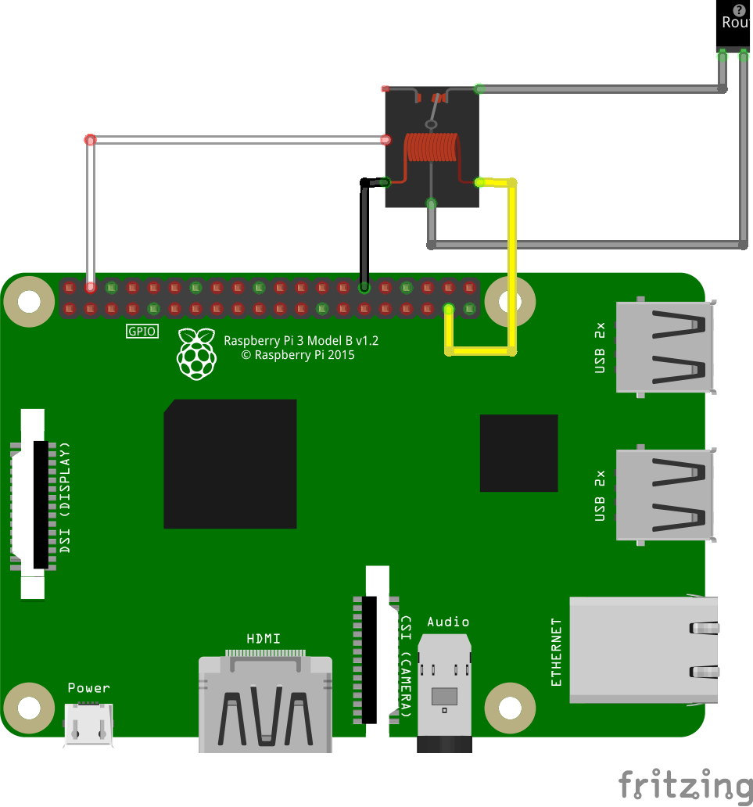
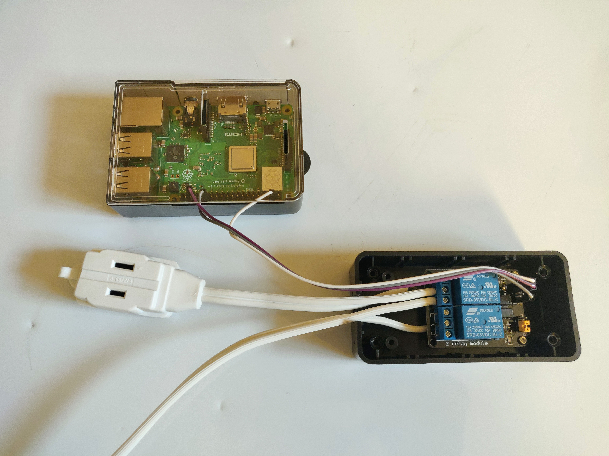
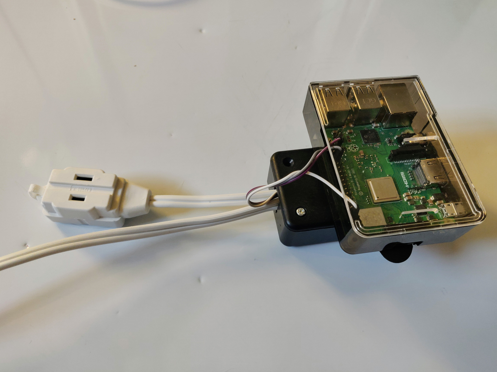

## Usage 
- ssh into raspberry pi (using putty because i'm on windows)
- Use screen to start the python script and let it run after closing putty
  - ```
       $ screen
       $ python3 wifi-toggle.py
  - detach from screen using CTRL + a, d
  - reattach to screen using ``` screen -r ```

## Schematic


## Final Product


